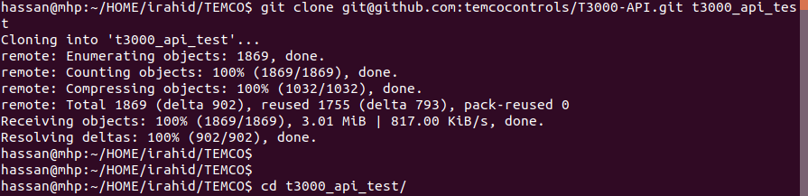
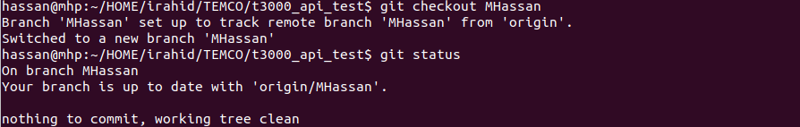
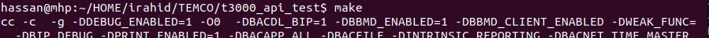
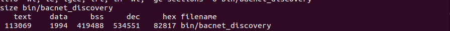
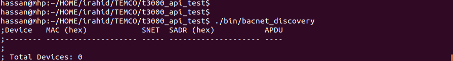
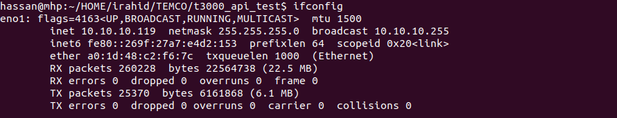
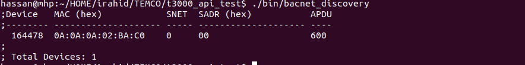

# Build Process for BACnet bins

1. git clone

    * `git clone git@github.com:temcocontrols/T3000-API.git t3000_api_test`

2. Jump to MHassan branch:

    * `cd t3000_api_test`
    * `git checkout MHassan`

3. Now, to build the bacnet part, we do make:

    * `make`
    * This will do all the compilation and generate the bacnet_discovery binary in bin directory

4. To run it:

    * `./bin/bacnet_discovery`

5. it should show the devices, if it doesn't show the list configure the interface for it

    * do: `ifconfig`
    * and get the interface name, in my case it is eno1
    * `export BACNET_IFACE=eno1`

6. run the binary again

    * `./bin/bacnet_discovery`

